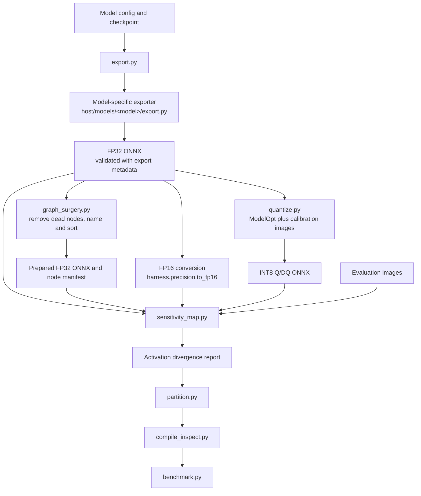

# Host pipeline

The scripts here handle shared ONNX preparation and analysis. Model-specific checkpoint loading and export stay in `host/models/<model>/`.



`graph_surgery.py` is optional for conversion and calibration. `sensitivity_map.py` uses its prepared graph and node manifest when available; otherwise it reads the FP32 export. Precision variants are derived from the registered FP32 ONNX model. FP16 conversion uses the shared precision utility, while INT8 uses ModelOpt and calibration images.

## Commands

Run from the repository root. Export and graph preparation use the selected model spec and backbone:

```bash
python host/pipeline/export.py --spec rtdetr --backbone r101vd
python host/pipeline/graph_surgery.py --spec rtdetr --backbone r101vd
```

Convert FP32 ONNX to FP16:

```bash
PYTHONPATH=host python -c "from harness.precision import to_fp16; to_fp16('host/models/rtdetr/model_r101.onnx', 'host/models/rtdetr/model_r101.fp16.onnx')"
```

Calibrate INT8 with COCO images in the separate ModelOpt environment:

```bash
python host/pipeline/quantize.py --backbone r101vd --calib 200
```

Compare available ONNX variants on COCO images:

```bash
python host/pipeline/sensitivity_map.py \
  --backbone r101vd --variants fp16 int8 --limit 4
```

The sensitivity report measures intermediate tensor differences against FP32. It screens nodes for further investigation; it does not measure mAP or prove that a node causes an accuracy drop. Run `host/models/rtdetr/eval_map.py` for COCO mAP.

`partition.py`, `compile_inspect.py`, and `benchmark.py` are placeholders and do not yet perform their described work. For TensorRT engine builds and Jetson inference, use [`deploy/`](../../deploy/README.md).

## Scripts

| Script | Purpose | Status |
| --- | --- | --- |
| `export.py` | Dispatch model-specific export, validate FP32 ONNX, and write metadata | Implemented |
| `graph_surgery.py` | Remove dead nodes, normalize graph names/order, and write a node manifest | Implemented |
| `quantize.py` | Calibrate and quantize ONNX to INT8 with ModelOpt | Implemented |
| `sensitivity_map.py` | Compare intermediate activations across ONNX precision variants | Implemented |
| `partition.py` | Generate precision partition constraints | Placeholder |
| `compile_inspect.py` | Build and inspect TensorRT engines | Placeholder |
| `benchmark.py` | Measure model accuracy and runtime | Placeholder |
